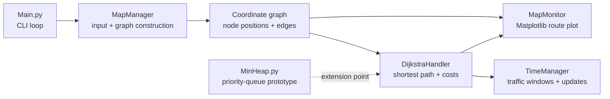

# Routing with Dijkstra's Algorithm

> An explainable Python route-planning prototype that combines shortest-path search with time-aware traffic costs.


> The image is a generated scientific visualization of the project's routing model. Its edge labels are illustrative; the executable project renders the actual input graph and selected route with Matplotlib.

This project models a customizable map as a weighted, bidirectional graph. Given a start node, destination node, and request time, it calculates a route with Dijkstra's algorithm, increases the cost of congested links, records the selected route's time window, and visualizes the result.

It is a compact algorithmic-AI project: the routing intelligence is deterministic, inspectable, and based on graph optimization rather than a trained machine-learning model.

## Why this project matters

Routing systems are a useful example of applied AI because they must make good decisions under constraints. This prototype demonstrates the foundations of that problem:

- represent a map as a reusable graph of coordinates and connections;
- evaluate route quality with a non-negative cost function;
- choose the lowest-cost path with Dijkstra's algorithm;
- account for changing traffic conditions over time; and
- expose the decision visually so a route can be inspected and debugged.

## Features

- Custom graph input with arbitrary node coordinates and undirected edges.
- Euclidean distance between connected nodes as the base travel cost.
- Traffic-aware edge weighting through a congestion multiplier.
- Time-window tracking for routes that have already been requested.
- Route reconstruction through a predecessor map.
- Matplotlib visualization of the full graph and selected route.
- Small, modular Python files that separate graph loading, search, timing, plotting, and heap experimentation.

## Algorithm and cost model

For each candidate connection, the implementation starts with Euclidean distance and applies a traffic penalty based on the neighboring edge's current traffic count:

```text
route_cost(u, v) = euclidean_distance(u, v) × (1 + 0.3 × traffic(v))
```

`DijkstraHandler` repeatedly selects the unexplored node with the smallest known distance, relaxes its neighbors, stores each predecessor, and reconstructs the route to the requested destination. `TimeManager` stores the time interval occupied by each selected connection and updates traffic counts when a later request overlaps an existing interval.

Because all route costs are non-negative, Dijkstra's algorithm provides an exact shortest path for the cost model used by the program. The traffic model is intentionally simple and provides a clear foundation for more realistic travel-time, capacity, or incident models.

## Architecture



### Module guide

| Module | Responsibility |
| --- | --- |
| `Main.py` | Reads the graph and repeatedly accepts routing requests |
| `MapManager.py` | Converts text input into a coordinate graph |
| `DijkstraHandler.py` | Runs Dijkstra search, applies traffic-aware weights, and stores route state |
| `TimeManager.py` | Tracks route occupancy windows and changes traffic counts for overlapping requests |
| `MapMonitor.py` | Draws graph nodes, links, and the selected route with Matplotlib |
| `MinHeap.py` | Custom heap implementation included as a data-structure extension point |

## Input format

The program reads from standard input.

### 1. Graph definition

The first line contains the number of vertices and edges:

```text
<vertices> <edges>
```

The next `vertices` lines define each node:

```text
<node_id> <x_coordinate> <y_coordinate>
```

The next `edges` lines define undirected connections:

```text
<node_id_a> <node_id_b>
```

### 2. Routing requests

After the graph is loaded, each request is read as:

```text
<request_time> <start_node> <destination_node>
```

The current implementation treats the first value as a simulation time scaled by `120` internally. It prints the reconstructed predecessor chain, displays the route plot, and prints the calculated travel time.

Example session input:

```text
5 6
1 0 0
2 2 1
3 4 1
4 6 3
5 8 2
1 2
1 3
2 3
2 4
3 4
4 5
0 1 5
```

The program continues waiting for requests until it is stopped with `Ctrl+C` or end-of-input handling is added.

## Setup and usage

The project is a command-line Python application and requires Python plus two visualization dependencies.

```bash
git clone https://github.com/amir-sbg/Routing-with-Dijkstra-algorithm.git
cd Routing-with-Dijkstra-algorithm

python3 -m venv .venv
source .venv/bin/activate       # Windows: .venv\Scripts\activate
python -m pip install --upgrade pip
python -m pip install numpy matplotlib
python Main.py
```

Paste a graph definition followed by one or more routing requests. A desktop display is required because `MapMonitor` calls `matplotlib.pyplot.show()`.

## Engineering notes

The project has a clear educational architecture and several good foundations for a production-quality routing engine:

- **Explainability:** every routing decision is derived from visible node coordinates, edge connections, distance, and traffic state.
- **Separation of concerns:** graph construction, search, time management, visualization, and command-line orchestration are separate modules.
- **Data-driven maps:** new maps can be supplied through input rather than encoded in the algorithm.
- **Reusable search state:** `getDistance()` and `getPrevious()` expose the latest search result for downstream consumers.
- **Visualization-first debugging:** plotting the entire graph and selected route makes algorithm behavior easy to inspect.

## Current status and roadmap

This is an algorithmic routing prototype rather than a production navigation service. The most valuable next steps are:

- add input validation for missing nodes, malformed lines, disconnected destinations, and end-of-file;
- return a structured route object instead of relying on printed output and mutable dictionaries;
- replace the current linear minimum scan with a tested priority queue for `O((V + E) log V)` performance;
- complete and unit-test the custom `MinHeap` implementation or remove it in favor of Python's standard `heapq`;
- formalize the traffic model with edge-specific travel time, capacity, and congestion decay;
- add deterministic fixtures and tests for distance, predecessor reconstruction, traffic overlap, and unreachable nodes;
- separate the plotting layer from the routing engine so the algorithm can run headlessly in services or notebooks;
- add a finite CLI command, JSON/CSV input, and machine-readable route output;
- compare Dijkstra with A*, multi-criteria routing, and learned travel-time prediction as the project evolves.

These changes would preserve the current algorithmic clarity while making the system easier to test, benchmark, integrate, and extend into a real routing platform.

## Validation

Run a syntax check with:

```bash
python -m py_compile DijkstraHandler.py Main.py MapManager.py MapMonitor.py MinHeap.py TimeManager.py
```

Then use the example input above to verify graph loading, route reconstruction, traffic bookkeeping, and visualization.

## License

No license file is currently included in the repository. Add an explicit license before redistributing the project.
